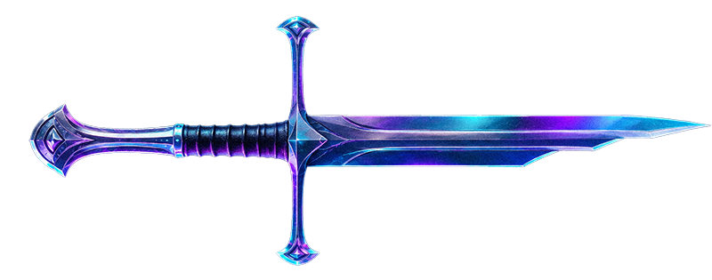
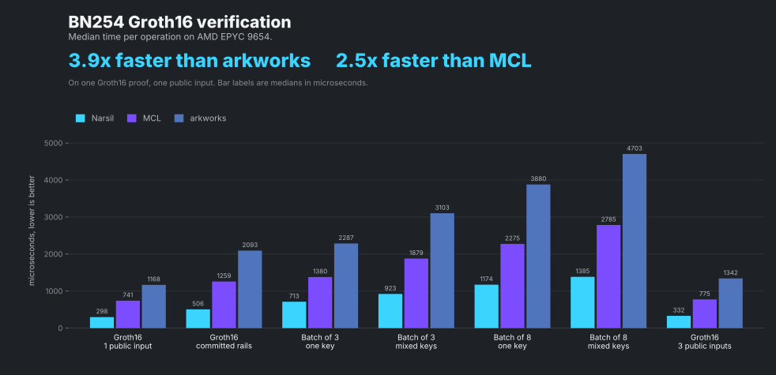
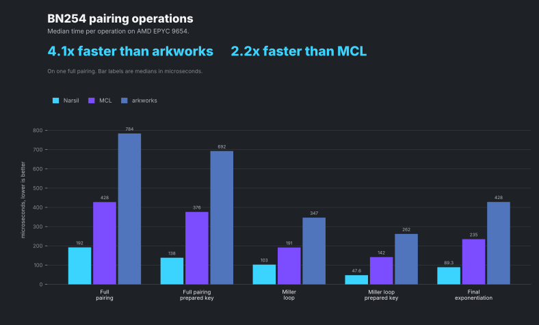

# helius-narsil




**Same silicon. New edge.**

Narsil is a SIMD hardware optimized Rust library for pairing friendly elliptic
curve operations. Its intended use is **verification**, with the main focus on
pairing check performance.

**DISCLAIMER.** This crate is experimental. **Do not** use it in production.
An audit and a production recommendation come later. Release 1.0 ships with
its own announcement.

BN254 is the only curve in this tree. A BLS family may follow.

## Do not use with secrets

No method in this crate is safe for secret inputs. Constant-time methods will
be named and documented one by one. Until a method is named that way, treat
every function as variable-time.

## Benchmarks





Two to four times faster than MCL and arkworks on modern hardware.

## Example

Groth16 is `e(alpha, beta) * e(L, gamma) * e(C, delta) * e(-A, B) = 1`.
`alpha` and `beta` stay in the verifying key. `gamma` and `delta` get prepared
G2 schedules. `A`, `B`, `C` and the public-input MSM `L` are online. Needs
`--features std`. See `examples/groth16.rs`.

```rust
# #[cfg(not(feature = "std"))]
# fn main() {}
# #[cfg(feature = "std")]
fn main() -> Result<(), helius_narsil::PreparedVerifierError> {
use helius_narsil::{
    FixedPair, Fr, G1Affine, G1Projective, G2Affine, G2Projective, LivePair,
    PreparedTerm, PreparedVerifier,
};

fn g1(k: u64) -> G1Affine {
    G1Projective::generator().mul_scalar(Fr::from_u64(k)).to_affine()
}
fn g2(k: u64) -> G2Affine {
    G2Projective::from(G2Affine::generator())
        .mul_scalar(Fr::from_u64(k))
        .to_affine()
}

let vk = PreparedVerifier::new(
    &[g2(1), g2(2)],
    &[FixedPair { g1: g1(4), g2: g2(1) }],
)?;
assert!(vk.verify(
    &[
        PreparedTerm { g1: g1(1), prepared_g2: 0 },
        PreparedTerm { g1: g1(1), prepared_g2: 1 },
    ],
    &[LivePair { g1: g1(1).negate(), g2: g2(7) }],
)?);
Ok(())
}
```

Byte-facade product check (`examples/product_check.rs`).

```rust
use helius_narsil::{G1Affine, G1Bytes, G2Affine, G2Bytes, PairBytes};

let p = G1Affine::generator();
let q = G2Affine::generator();
let pairs = [
    PairBytes {
        g1: G1Bytes::from_affine(&p),
        g2: G2Bytes::from_affine(&q),
    },
    PairBytes {
        g1: G1Bytes::from_affine(&p.negate()),
        g2: G2Bytes::from_affine(&q),
    },
];

assert!(helius_narsil::pairing_product_is_one(&pairs)?);
# Ok::<(), helius_narsil::InputError>(())
```

## Tests

[CI](https://github.com/Atamanov/helius-narsil/actions/workflows/ci.yml)
runs `cargo test` on rustc 1.97.1, the MSRV, and on stable. Each toolchain
runs three feature sets, `default` which is `no_std`, `std`, and
`std,force-portable`. The `default` cell also runs fmt, clippy, docs,
cargo-deny, and `cargo publish --dry-run`. CI covers the in-tree arkworks 0.5
native suite and `ark_differential`. MCL is not in CI.

```sh
scripts/install-git-hooks.sh
# pre-commit runs fmt. pre-push refuses a local-only branch, then runs fmt,
# clippy, and the unit tests. CI owns the full matrix.

cargo test --features std
# unit tests, integration tests, and the arkworks 0.5 native suite

cargo test --features std --test ark_differential
# public-API pairing, MSM, Fr, and encoding checks against arkworks 0.5

cargo test --features std --lib arkworks_bn254_0_5_tests
# the 103 default-native ark-bn254 / ark-ec / ark-ff 0.5 cases, adapted in-tree

cargo test --features mcl-oracle --test mcl_differential   # needs MCL_DIR
# pairing, Miller loop, final exp, and a small MSM against a local MCL tree

cargo bench --features std --bench pairing
# Miller loop, prepared Miller loop, final exponentiation, full pairing

cargo bench --features std --bench msm
# G1 variable-time MSM at 1, 8, 32, and 128 points

cargo bench --features std --bench field
# Fp and Fp2 mul / square

cargo doc --no-deps --features std
cargo publish --dry-run
```

`mcl-oracle` links a caller-supplied MCL tree. It is not a production
dependency.

## License

MIT OR Apache-2.0.

Copyright (c) 2026 Helius Blockchain Technologies, Inc.
